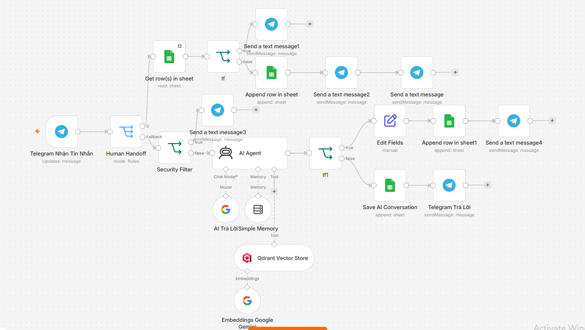

# AI Customer Support Agent

An AI-powered customer support agent designed to automate customer conversations while providing consistent, knowledge-based responses.

The project combines AI classification, a structured knowledge base, conversation handling, and automated response generation to support customer inquiries at scale.

## 🎯 Project Overview

Customer support teams often spend significant time answering repetitive questions about:

* Products
* Pricing
* Promotions
* Policies
* Frequently asked questions
* General customer inquiries

This project explores how an AI Agent can automate these conversations while keeping responses grounded in a controlled Knowledge Base.

## 💡 Business Problem

A typical customer support process may require agents to:

* Read incoming customer messages
* Identify the customer's intent
* Search for the relevant information
* Formulate an appropriate response
* Maintain conversation context
* Handle different types of customer questions consistently

As conversation volume increases, this can create repetitive work and inconsistent response quality.

## 🚀 Solution

The AI Customer Support Agent creates an automated conversation pipeline:

```text
Customer Message
       ↓
Intent Classification
       ↓
Knowledge Base Routing
       ↓
Relevant Information Retrieval
       ↓
AI Response Generation
       ↓
Customer Response
```

The system is designed to keep the AI grounded in approved business information rather than allowing it to freely invent answers.

## 🔄 Agent Architecture



The workflow separates the conversation into several logical stages:

1. Receive the customer's message.
2. Classify the customer's intent.
3. Identify the appropriate Knowledge Base category.
4. Retrieve relevant business information.
5. Generate a concise response using the available knowledge.
6. Return the response to the customer.
7. Maintain conversation context for subsequent messages.

## 🧠 Intent Classification

The agent categorizes customer messages before generating a response.

Current categories include:

* **Product**
* **FAQ**
* **Promotion**
* **Policy**
* **General**

This classification allows different types of customer questions to be handled using the appropriate knowledge source.

## 📚 Knowledge Base

The Knowledge Base acts as the controlled information layer for the AI Agent.

The agent is instructed to:

* Use information from the Knowledge Base
* Respond in Vietnamese
* Keep responses concise
* Avoid inventing information
* Stay within the available business knowledge

This approach helps reduce hallucination and provides more predictable customer-facing responses.

## 👥 Conversation Ownership

The agent is designed with conversation ownership in mind.

Each conversation should have a clear state and ownership context so that automated responses do not conflict with human support activity.

This creates a foundation for scenarios where:

* AI handles routine questions
* Human agents take over more complex conversations
* Existing conversations remain associated with the appropriate handler
* Automation can respect the current conversation state

## ✨ Key Features

### 1. AI Intent Classification

Customer messages are automatically categorized before response generation.

### 2. Knowledge-Based Responses

Responses are grounded in the business Knowledge Base instead of relying solely on general model knowledge.

### 3. Structured Response Generation

The AI follows predefined instructions for response style, language, and information boundaries.

### 4. Conversation Context

The workflow is designed to maintain conversation context so that follow-up messages can be handled consistently.

### 5. Human-in-the-Loop Foundation

The architecture supports transferring conversations from AI automation to human support when necessary.

### 6. Reusable Support Architecture

The workflow can be adapted to different businesses by replacing the Knowledge Base and business rules.

## 🛠️ Technology Stack

| Technology             | Purpose                                       |
| ---------------------- | --------------------------------------------- |
| **n8n**                | Workflow automation and orchestration         |
| **AI / LLM**           | Intent classification and response generation |
| **Knowledge Base**     | Controlled business information               |
| **Google Sheets**      | Structured data / knowledge storage           |
| **Messaging Platform** | Customer conversation interface               |
| **Prompt Engineering** | Response behavior and business rules          |

## 📊 Example Conversation Flow

```text
Customer:
"Chị ơi sản phẩm này còn hàng không?"

        ↓

Intent Classification

        ↓

Product

        ↓

Knowledge Base

        ↓

AI Response

        ↓

Customer receives a concise,
knowledge-grounded answer.
```

A different question follows a different route:

```text
Customer Question
        ↓
"What is your return policy?"
        ↓
Policy
        ↓
Policy Knowledge Base
        ↓
AI Response
```

## 🎯 Project Highlights

This project demonstrates how AI can be integrated into an operational customer support process rather than used only as a standalone chatbot.

Key capabilities demonstrated:

* **AI Agent design**
* **Intent classification**
* **Knowledge-grounded generation**
* **Conversation management**
* **Human-in-the-loop architecture**
* **Prompt engineering**
* **Business rule integration**
* **Workflow automation**

## 🔐 Security & Privacy

The public repository should contain only sanitized workflow assets prepared for portfolio purposes.

Private information such as:

* API keys
* Platform credentials
* Customer information
* Private conversation data
* Production account information

should not be included in the public workflow.

## 📁 Repository Structure

```text
ai-customer-support-agent/
│
├── README.md
│
├── assets/
│   ├── workflow-overview.png
│   └── conversation-example.png
│
└── workflow/
    └── ai-customer-support-agent-clean.json
```

## 📌 Future Improvements

Potential future enhancements include:

* More advanced conversation ownership
* Human agent handoff
* Conversation history management
* Customer sentiment detection
* Escalation rules
* Analytics and support performance tracking
* Multi-channel support
* Improved Knowledge Base retrieval

The architecture is intentionally modular so additional AI capabilities can be added without rebuilding the entire support workflow.
